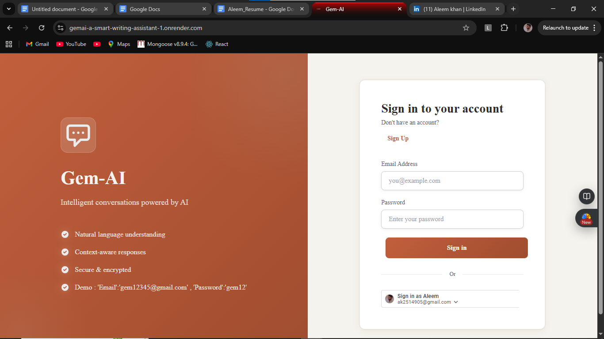
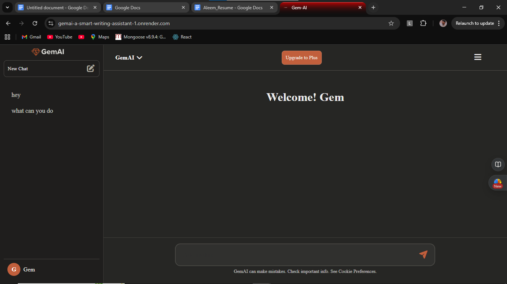
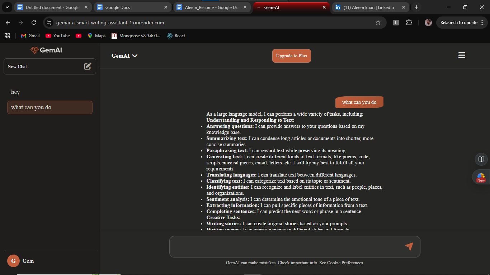

# GemAI — AI Writing Assistant

A full-stack AI assistant that uses Google Gemini for generating intelligent, conversational replies. The project includes a React + Vite frontend and a Node.js + Express backend with MongoDB persistence and optional Upstash Redis caching.

Key features
- Chat with AI using Google Gemini (server-side API calls)
- Google Sign-In and email/password authentication (JWT)
- Persisted chat threads per user in MongoDB
- Uses Upstash Redis for lightweight caching (optional)

Repository layout
- backend/ — Express server, controllers, routes, DB code
- frontend/ — React + Vite app (UI and auth flow)

Quick start (development)

Prerequisites
- Node.js 18+ and npm
- A MongoDB connection string (Atlas or local)
-  Upstash Redis credentials if you want to enable OTP and user caching
-  Resend API key to send verification emails
- Google Cloud / OAuth client credentials and a Gemini API key to use the AI features

1) Install dependencies

```powershell
# backend
cd backend
npm install

# frontend
cd ..\frontend
npm install
```

2) ENV variables (backend)

Create a `.env` file in `backend/` with the following (example):

```
PORT=8080
MONGODB_URI=mongodb+srv://<user>:<pass>@cluster0.mongodb.net/gemai
JWT_SECRET=your_jwt_secret_here
GOOGLE_CLIENT_ID=your_google_oauth_client_id
GEMINI_API_KEY=your_google_gemini_api_key
FRONTEND_URL=http://localhost:5173
UPSTASH_REDIS_REST_URL=your_upstash_rest_url    # optional
UPSTASH_REDIS_REST_TOKEN=your_upstash_token    # optional
RESEND_API_KEY=your_resend_api_key              # optional (email sending)
```

Notes:
- The backend expects `MONGODB_URI` (used in `backend/DB/db.js`) and `JWT_SECRET` for signing JWTs (used across auth middleware/controllers).
- `GOOGLE_CLIENT_ID` is used to verify Google ID tokens server-side.
- `GEMINI_API_KEY` is required for the AI responses (see `backend/utils/AIresponse.js`).

3) Run the servers

```powershell
# Start backend (development)
cd backend
npm run dev

# Start frontend (development)
cd ../frontend
npm run dev
```

Frontend dev server (Vite) typically runs at `http://localhost:5173`.

API overview (important endpoints)
- POST /api/auth/google — Google sign-in (body: { token })
- POST /api/auth/signup — Email signup
- POST /api/auth/login — Email login
- POST /api/auth/verifyemail — Verify OTP sent via email
- POST /api/chat — Create/append to a chat thread and get AI reply (requires Authorization: Bearer <token>)
- GET /api/threads — Get current user's threads (requires auth)

Frontend notes
- `frontend/src/LoginPage.jsx` currently uses a Google client id constant; for production move this to an env var in Vite by using `VITE_GOOGLE_CLIENT_ID` and reference it via `import.meta.env.VITE_GOOGLE_CLIENT_ID`.
- After successful login the app stores `authToken` and `user` in `localStorage` (keys: `authToken`, `user`).

Development tips
- If you use Upstash Redis, set `UPSTASH_REDIS_REST_URL` and `UPSTASH_REDIS_REST_TOKEN`. The code will try to initialize a client when these are present.
- The project uses `resend` to send verification OTP emails (set `RESEND_API_KEY`).
- The AI request uses a simple server-side POST to the Google Generative Language endpoint with `GEMINI_API_KEY`.

Deployment
- Make sure to set all environment variables (Mongo URI, JWT secret, Gemini/Google keys, Redis/Resend creds) in your deployment environment.

Testing
- You can test auth flows via Postman. For protected routes, include the `Authorization: Bearer <token>` header.

## 📸 Screenshots

### Login Page
()

### Chat Interface
()

### Chat History
()

Help & contribution
- If you'd like help wiring up environment variables into the frontend (Vite) or moving the hardcoded Google client id to an env var, I can make a small PR.

Author
- Aleem Khan

License
- MIT


